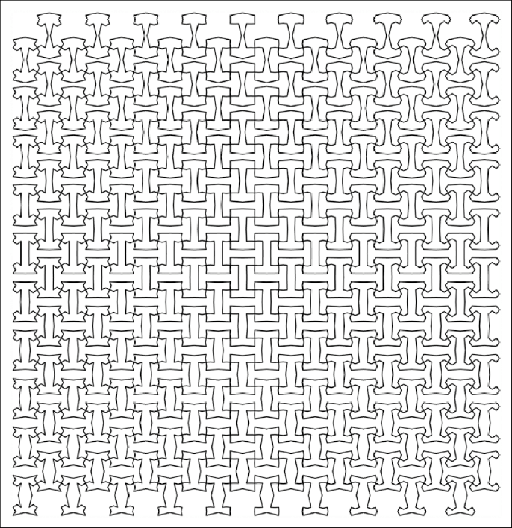

I generally enjoy reading Paul Graham's essays, but when I first read his essay on [independent thinking](http://www.paulgraham.com/think.html) in Nov 2020, I admittedly found it a little bit frustrating. 

It was interesting -- well-written as usual. It was validating, as it describes what I'm doing right. But in my self-absorbed way, the way he went about blithely extolling the virtues of independent thinking while I was dealing with problems that arose from this very independent thinking was pettily but profoundly irritating. 

Graham talks about how one might become more independent-minded, and the first one, 'to be unaware of conventions' (or, for want of powers of perception), is how I unknowingly took the independent minded route. And, justified by my lack of choice in the matter, I would like to complain about it: It is good to aspire to be better than the sheep, but at least sheep are generally about average -- with being independent, there is the real pitfall of being _worse_ than average. 

My friends would know, as they gleefully keep a list of my 'surprisingly basic' failings.

So I am not particularly concerned with trying to think independently because I do not find it hard to think independently. I succeed with flying colors. But I think it is hard to think independently _well_. 

This is an attempt to address what my younger self would've wanted to read about at the time. Because once upon a time, I was mirred in a mild crisis of self-doubt. I would like to not be in this situation and it was rather painful. 

When Graham's essay came out, I had been struggling to integrate with the biology of aging field for the past two years, and not being able to make it sit comfortably – I could consciously follow why people think this is cool, but I could not emotionally relate (maybe because I am very okay with the idea of my own mortality). Many in the aging field are satisfied with answers that I feel is not sufficiently satisfactory, but I was having difficulty making headway in a direction that I felt was more compelling. It was like arriving at an answer that differs from the majority of people -- naturally, being a more unconfident sort, I suspected I had a miscalculation somewhere, but I couldn't figure it out. I found that there is a loneliness in being out of sync with people.

I had been listening to the portal podcast around that time (perhaps specifically "40: Introducing The Portal Essay Club - What if everyone is simply insane?" on Apple Podcasts) and it occurred to me that this is what an insane person might think. Arguably, insane means a critical distance from your norm, and so it is relative, possibly mutually perceived. In the same week, I happened to meet a conspiracy theorist. He sounded pretty reasonable, like a critical thinker, with some takes that question the norm. It wasn't until he started commenting on the areas I was well-versed in that I realized that his takes were probably worse than default. I thought of "A Beautiful Mind", a horror film that bills itself as 'drama' -- it is horrifying to be in a situation where you can't trust your sense of reality. You can question the herd, do things your way, and be worse -- you could be a conspiracy theorist. 

>PG's internal structure for independent thinking:
>1. fastidiousness about truth
>2. resistance to being told what to think
>3. curiosity
>
>(I think if I were a conspiracy theorist, I would think that I have all of these things.)

And of course, it was then easy to draw the lines between conspiracy theorizing and my critical thoughts about the aging field. 

Then came [the Jan 6th Capitol attack](https://en.wikipedia.org/wiki/January_6_United_States_Capitol_attack ), which was not helpful at all in this regard. A turning point was watching CNN coverage of the capital storming, and the news anchor going, ‘this is not the America we know’ in a ‘I’m surprised by your bad behavior – you should know better and I’m very disappointed in you’ kind of tone. My internal reaction to that was, 'isn’t that your job? to keep a finger on things that are happening throughout America and be able to provide useful commentary on why we’re seeing what we’re seeing? This is admitting your failing as a newsperson if this is not the America you know, because that means your models are wrong and you should correct them – what are you going to do about it??’ This was a new low on the unreliability of established media outlets. It took some time for my strong criticism to propogate through my accultured sense of media authority, but it did, and the best way I can currently describe the feeling is a sense of disconnect with the mainstream narrative. 

If you find yourself distrusting large groups of people, groups that are perceived to have authority, how do you develop a stable sense of reality? 

When I was sufficiently overwhelmed, I went to my close friends, and received reassurance and future insurance/assurance: the solution to this problem is friends. Not just any good friend, but friends that are good at critical thinking in a way that you admire (what if you have bad taste in what is good taste?1). You want friends that will be frank with you and tell you what they think (and you should try your best to adopt an attitude that makes them willing to do so). 

Things eventually got better. In summer 2021, a friend recommended ‘Edison as I knew him’, citing this particular passage:
>“That bang on the table was worth worlds to me. No man up to then had given me any encouragement. I had hoped that I was headed right, sometimes I knew that it was, sometimes I only wondered if I was”.

And somehow it was grounding to get an example that it is normal to have doubts, and it is important to seek those who can encourage you. 

I suspect that independent thinking, ironically, is best done with the help of others. Graham does note this, that you should find independent-thinking friends to talk to, but I think it's moreso framed in the context of being exposed to unconventional thinking. 

But I think if you're anything like me, a particular value of friends is so that your attempt at independent thinking doesn't take a bad turn. In the end, reality is rather local, and who you are, how you perceive, is shaped by those near you.

---

[1] I'm sorry, I haven't thought that far -- find better friends? 

&nbsp;
&nbsp;
&nbsp;

---

_comments solicited, [kludgey comment-able form here](https://docs.google.com/document/d/1jF0s0IVLF338Uvgy1RKo4P8roP7ESnwwJGbsBUhwcGQ/edit?usp=sharing)._