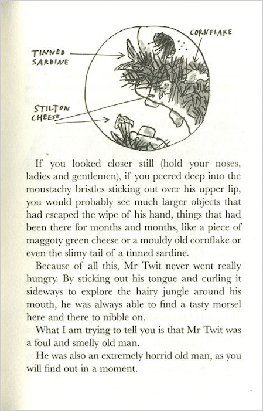

 

I have read four sci-fi short stories in recent memory, and two of them have been produced in the Netflix series “Love, Death, and Robots”. One of them is “Zima Blue”, and as typical of someone who’s 'read the book' (it was a [pdf](../documents/Zima_Blue.pdf)), I have some complaints.

They completely omitted the dialogue the journalist had with artist (Zima), on the journalist’s choice to use an infallible AM (augmented memory) device versus a neural implant that functioned like an extension of natural memory: 

>"But if the AM had accompanied me, I'd have a flawless record of how things really were."
>
>"You would," Zima said. "But that isn't living memory. It's photography; a mechanical recording process. It freezes out the imagination; leaves no scope for details to be selectively misremembered...The memories stored in the AM are fixed for eternity. You can query it as often as you like, but it will never enhance or omit a single detail."
>
“In contrast, neural implants are “necessarily plastic, malleable, subject to error and distortion."
>
>"Fallible," I said.
>
>"But without fallibility there is no art. And without art there is no truth."

…honestly, that last sentence is a bit beyond me. But the rest of it concurs with an pattern that's become more salient recently. 

It's at least partly resonant because I seem to have naturally subpar memory capabilities, making it convenient for noticing how much detail is regularly omitted. It does not seem to be a function of age, since I’ve been working with my below-average memory since I was a child: 
- The heuristic I used to clean my room was ‘if I won’t remember that I owned this, it’s fine to toss’, and many things were easily dumped that way.
- I learned to go to sleep when I was upset because I’d remember the details of the issue when I woke up, without the emotional memory of being upset (I remembered being upset as a fact).  
- When I was in middle school, my younger sister thoughtfully gave me a paper memory card for my birthday (‘because you seem to need it’).  

And it has not really abated since I’ve become an adult:
- I consistently evoke commentary from friends and family with how forgetful I am. 
- A friend had a mini-stroke (TIA), complained about their resulting worse memory, and it was still better than mine, stroke-less. 
- I am a massive tab hoarder in an attempt to help me refind interesting things. But it's like being a twit (see figure at right), if I poke around my old tabs, I'll find a surprisingly tasty morsel and think, 'what good taste this person has!']

Society thinks more memory is great: Photographic memory is associated with genius, forgetting is a sign of dementia, more is better in America, etc. I also think more memory is great – I upgrade the RAM with each new laptop – but as an experienced forgetter, I think there're aspects of forgetting that is underappreciated.

I. Why value forgetfulness?

Maybe a year or two ago, in the room I stay in my parents’ apartment, I remember a snippet of conversation where my dad told me about his friend who has excellent memory--and rather messy code. His friend didn’t bother organizing it because he had no problem remembering where everything was. I don’t remember how the conversation began or much else.

It was easily memorable because my experience maps to the inverse: With unreliable memory, I need to put considerable effort towards organizing things for them to be reasonably retrievable, or else suffer tip-of-tongue even worse than I do now (a twenty-something friend said that their mother was starting to suffer from it -- it started in middle school for me). The journalist in Zima Blue with her AM is likely like my dad’s friend, with great record and recall -- and with no need to organize. But we don't have AMs in this [day and age](https://www.youtube.com/watch?v=0dCCOsnXmAQ&list=PLcnPdZHPO1-bV9MsSZAkMa_Pur-on-Ueq&index=10) so some Douglas Adams might be relevant:

>“The thing is that your memory doesn’t actually get any bigger, and a lot of stuff just falls out. So you see, the major difference between you and me is not how much I know, but how much I’ve forgotten.” - (“Dirk Gently”, 209)

Though what I mean to discuss is not mere forgetting, but specifically biased/organized forgetting. Technically, you can be forgetful and not organize but then that's undeniably worse and uninteresting. I mean to talk about forgetting in the context you have things you care about. Someone once asked me why I read so much if I forgot most of it (I can't recall if it was asked or if it was just obvious). I was stumped for a few days, but I arrived at a satisfying answer: For the stuff I do remember from the books. 

Because the things I do remember tend to be the interesting bits. And by forgetting the rest, I've just increased the signal to noise ratio. This is pretty much the domain of compression, and I discovered through a fascination with PCA (Principal Components Analysis). 

Most proportion of variance plots (aka 'scree plots') look like this. Assuming your data/signal of interest is in the top PCs, why not just remember two variables that account for 70% of the variation in the data instead of 10 or more variables? In a class on the geometry of data, it seems like a lot of phenomena are much lower dimensionality than it theoretically can be, which I think is an interesting nugget. I think a similar principle is why it's impressive that this:

can be represented with this:

[z = z^2^ + c]

Instead of memorizing the layout of pixel colors, you just apply this iteratively (and set color thresholds). 

Similarly, instead of mapping out the pixel trajectory of simulated ball ejection, we can just use the formula for a parabola. Or we could model physical laws like gravity. They're both compressive, so the question becomes, how do you choose between different compression options? Is it arbitrary? In ["Analogies and Roles in Human and Machine Thinking"](https://dll110.github.io/documents/Douglas%20Hofstadter%20-%20Metamagical%20Themas_Ch%2024%20Analogies%20and%20Roles%20in%20Human%20and%20Machine%20Thinking.pdf), Hofstadter argues that while there is a lot of subjectivity, there are analogies that people find uncontroversially better. 

I never finished Julian Jaynes book "The Origin of Consciousness", but I do remember it had a great discussion about the role of metaphor in understanding, and it helped internalize the idea "All models are imperfect, but some are useful." --and some are more useful than others. At least, depending on context: implementing the parabola would take less time, but not if you are building a videogame of more than minimal complexity -- the simulated physics has more explanatory power; it would scale. 

I am reminded of this paper, whose title suffices as an explanation, I think:
[Driven by Compression Progress: A Simple Principle Explains Essential Aspects of Subjective Beauty, Novelty, Surprise, Interestingness, Attention, Curiosity, Creativity, Art, Science, Music, Jokes](https://arxiv.org/abs/0812.4360). And I will henceforth compress ‘Subjective Beauty, Novelty, Surprise, Interestingness, Attention, Curiosity, Creativity, Art, Science, Music, Jokes’ as ‘aesthetic’. This is where aesthetic comes in -- the concept of aesthetic seems to arise from contexts where are a multitude of ways you can compress (or not), and your aesthetic directs your particular implementation. This compression does not need to be a conscious decision; when you find something beautiful, you naturally pay attention to the beautiful thing and ignore other details. This is how details can be enhanced -- by forgetting the rest.  

Kauffman in "The Origins of Order" points out that each connection constrains a system's degrees of freedom: avoid unnecessary connections if possible. This maps to the programming practice of modularity, or what you learn to bring with you if you move houses often and/or backpack (I've noticed for myself that by having less stuff, I lower the activation energy to transition), and I'm sure there's a gardening metaphor somewhere that illustrates the virtues of aggressive pruning (maybe in art of bonsai-trees?). You learn to identify what the essentials are, what _is_ meaningful/meaning-dense, in a more concise form, and there's something rather peaceful about that. 

I think this is related to maneuverability/agility. If you needed to make hard decisions, fast, how well would you do? How good are your tools in an uncertain environment? How well can your models adapt to change? There is not an optimal way to be because it depends on the environment, and the environment is always changing. 

In college, a friend commented on how people seem to stagnate in middle age, seemingly because they get entrenched in their norms. I can understand how that convergence happens (because I am naturally lazy, and entrenchment is a lower-energy state), but it sounds unappealing – at some point in a long life, should you wipe your slate clean, start naive, and build models anew? No one seemed to advise this. Until I encountered Hamming some years later: 
>Somewhere around every seven years make a significant, if not complete, shift in your field. Thus, I shifted from numerical analysis, to hardware, to software, and so on, periodically, because you tend to use up your ideas. When you go to a new field, you have to start over as a baby. You are no longer the big mukity muk and you can start back there and you can start planting those acorns which will become the giant oaks. - ([You and Your Research](https://www.cs.virginia.edu/~robins/YouAndYourResearch.html))

And another, a number of years later, from the esteemed Douglas Adams:
>"...don't you understand that we need to be childish in order to understand? Only a child sees things with perfect clarity, because it hasn't developed all those filters which prevent us from seeing things that we don't expect to see." (“Dirk Gently”, 183)

I interpret these filters he references to be our models. We compress and develop models to better navigate everyday life because they are so much more efficient. But no model is perfect, and in its errors, we are vulnerable and often, [oblivious](dll110.github.io/poop/overconfidence). 

It was interesting to come across yet another concurrence recently from sci-fi author Roger Williams:
>“If we become immortal, and we occasionally grow and change, then we must also occasionally un-grow or we will eventually run out of room in whatever space we are growing. This is true whether we grow by throwing massive problems at our Jupiter-sized brains or by breeding like bunny rabbits. In real life un-growth occurs through decay and death, the very things we seek to avoid by building a Seed AI. I feel that any stable post-Singularity human existence would have to include some kind of managed un-growth; perhaps a gradual forgetting, or a periodic reset as in the movie Vanilla Sky. Unfortunately, our drives being what they are, we would inevitably find any workable form of un-growth unpleasant.” - [MOPI](http://localroger.com/prime-intellect/mopising.html )

He gestures to an interesting point: We seem to have a natural inclination against forgetting/ungrowth -- why is that?

II. Sure sure, let's say forgetting has its virtues -- but then why do we not value it more?

Maybe it’s sunk cost fallacy, because it usually requires significant effort to make the framework/understanding/whatever in the first place. Or maybe it’s closer to activation energy, because they know how much it'll cost to build another one and dread it. But I’m one of the laziest people I know and I'm great at this (or perhaps you need to be sufficiently low RAM to be ~~desperate~~ motivated).

I propose that a possible antithesis to forgetting is this ineffable thing called sentimentality. They are sometimes referred to as ‘attachments’. It's that urge driving people to photograph/video everything, to not dump the useless but cute stuffie, to live in the past, to try to live forever, etc. (arguably, wanting to live forever is an attachment to yourself -- ultimate narcissm?) 

Why are we sentimental? 

My naive response was 'because we like to attach ourselves to things we like', but because therapy exists I suspect we attach ourselves to things we arguably don't like as well. 

Perhaps it's just momentum -- things you encounter/experience trains the model of 'you'. Whether you subsequently remember them or not, they tweak the weights, creating tendencies of thought, which become ruts of thought, whose aggregate patterns characterize 'you'. As Hofstadter claims, "Each of us exhibits a cognitive style that in essence defines the ruts we are permanently caught in. (537)". 

And the implication of having a cognitive style is that there is commitment to a system, in the way that using an operating system or langauge is a commitment to its underlying grammar and idiosyncracies. And somehow, in committing to a system, we seem to want to stick with it -- perhaps this is sunk cost fallacy after all. Maybe it's why people don't want to die. This seems normal enough, but I am not convinced that striving for immortality is a good idea. 

I wonder if it's also part of a cultural value of progress, parallelizing the attitude that 'you don't need to budget if you just have sufficient income'. That's fine if it's true in that context, but I have significant doubts that the concept of budgeting/compression/forgetting will become obsolete. 

III. Is there a case for dying in a timely fashion?

The theoretical biologist Robert Rosen wrote this paper called ["Cells and Senesence"](https://dll110.github.io/documents/Rosen_CellsAndSenesence1978%20(dragged)%203.pdf), where he has you consider as a model of 

		n(T) = n(0)e^(a - p)T^ 

where 
- n(0) is the starting population,
- n(T) is the population at time T,
- p is the rate of decay, and
- a is the rate of proliferation

and comments:

>"...if the rate of proliferation is a decreasing function of time, then if (a - p) is initially positive, the population will initially grow and then senesce. This, crudely, is the behavior characteristic of Hayflick’s clonal senescence, or Danielli’s spanning. In all cases, it occurs without any senescence of the individual elements; it only requires a temporal decrease in the rate of proliferation, not an increase in the rate of mortality. **Paradoxically, we note that the decrease in proliferation rate, with its attendant increase in the life span of the individual elements in the population, actually implies extinction of the population as a whole; the greater the increase in individual life span, the sooner the population will die out.**"

Of course, we are not cells whose lifespan 'ends' when they are split into two, but here's it's a mappable case where individual lifespan is at odds with population lifespan. I am not confident it is the most relevant metaphor, but the bar isn't high in this field, and there seems to be [a convenient positive correlation between age of first offspring and life expectancy](https://www.nature.com/articles/315319a0). No matter, we need not wait for life maximalists to succeed to see how this particular model plays out, because [decreased proliferation rate seems to be a trend of global population right now](https://www.amazon.com/Great-Demographic-Reversal-Societies-Inequality/dp/3030426564). To be fair, you'll want the life maximalists to succeed in order to see this trajectory in its full glory (and I think the ability to see various arcs of humanity is something to regret with a limited lifespan, but then, I suspect that is something more aspirational than deeply meaningful, otherwise I would love history much more than I do now). 

I suspect that the tradeoff of longevity is adaptability:
>“K-selected species are characterized by long gestation periods lasting several months, slow maturation (and thus extended parental care), and long life spans. In addition, they tend to inhabit relatively stable biological communities, such as late-successional or climax forests (see ecological succession)." - [Britannica](https://www.britannica.com/science/K-selected-species)

And when the environment is no longer stable, something needs to change: your models, or you. I collected this unexpectedly anthropological tidbit from a book on theoretical biology a while back that seems relevant:
>“We might even say that the models embodied in an anticipatory system are what comprise its individuality; what distinguish it uniquely from other systems. As we have seen, a change in these models is a change of identity; this is perhaps why, for human beings, the preservation of models becomes identical with the preservation of self. The identification of one's self with one's models explains, perhaps, why human beings are so often willing to die; i.e. to suffer biological extinction, rather than change their models, and why suicide is so often, and so paradoxically, an ultimate act of self preservation.” - (“Anticipatory Systems”, p403)

I find this an evocative way to think about how people might feel about their beliefs and identity. And while science is purportedly about a continual updating of knowledge, its proponents do not seem exempt from this phenomena, as there exists the adage, "Science progresses one funeral at a time."

Yet the prevailing belief seems to be "death is bad" -- and I find myself a bit alone there. 

I can come up for a rationalization for it, namely on the consideration that a local optima does not necessarily correspond to a global optima. In other words, I'm generally wary claiming that something is objectively 'good' if I am not sure of the bigger picture. I find that it is hard to make strong value claims because they can easily slip with a different perspective. Here, my imagination thinks it is possible to find things worse than death, and in those cases, death would be good. 

But I suppose my rationalization is significantly influenced by a relative lack of existential dread. This was especially highlighted during my stint in aging research, where there is a sensibly high concentration of existential desperation that even I, oft characterized as oblivious, noticed. This is compounded by my small size, which inspires the occasional peppy comment, ‘you’ll probably live a long time!’ (part of why I don’t believe in God is because it'd imply a perverse cruelty in allocating things people deeply desire to people who blithely have them). I watched A.I. as an elementary schooler and was mildly traumatized by the idea of waking up in the future where no one you love exists anymore. I bring up my fear of a future where [All My Friends Are Dead](https://www.amazon.com/All-My-Friends-Are-Dead/dp/0811874559), and they often flippantly say that you just make younger friends. 

Ironically, I suppose that they anticipate they can rely on the strategy of forgetting, while I don't seem to trust in my great ability of forgetting in this realm, or perhaps my imagination here is unusually lacking, but prospectively, a world where most of the people I know today will be gone is just rather depressing. I guess we’ll see whether my forgetfulness or sentimentality wins out. (Though, this is a moot point if I die first.)

Perhaps another iteration of myself would be supportive of immortality. But this iteration is pretty fine with dying (and on this hill). It is easily appeased and inspired by quotes like,
>“We have but a short life to live here my dear friend. But let us make it long by noble deeds.” - [Salmon Chase to Edward Stanton](dll110.github.io/lincoln)

----

