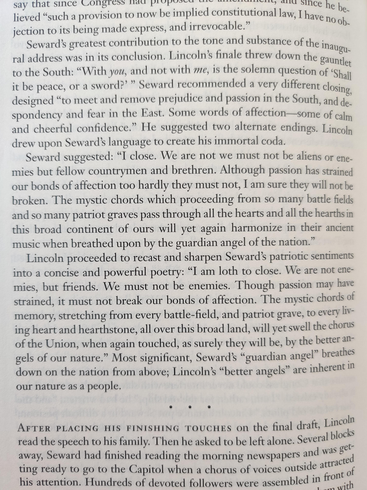

I picked up “Team of Rivals” browsing through some shelves one night, in want of a compelling book. It was not completely random. I might’ve been motivated to read a biography when I was writing ‘narratives’, and realizing that biographies would probably similarly inspire one on a narrative of ‘how to be’. And Lincoln in particular has a connotational halo in my head of someone who is of great moral character, a potential reference point for the question of ‘how to be’. I was not wrong. Also this title was primed because it has been on my book list since 2016/03/09 (I have self-indulgent, unnecessarily-detailed documentation), probably from a cardiothoracic surgeon named Nat (while it took more than seven years, the recommendation was not for nought).

I was surprised to find that “Team of Rivals” has many elements of an adventure story, with an underdog protagonist with humble beginnings, being scrappy and traveling long distances to make something of themself, and getting caught up in a war for an idealistic cause. I also associate ‘world building’ with fiction, so I was surprised to notice that here too has elements of world building that contextualize these characters. Though one thing “Team of Rivals” more effectively communicates is the prevalence of pestilence; the deaths of family and friends due to epidemics almost seem routine – I am now more salient of the impact of 20th century medicine. Otherwise, this is just a smaller, quaint world, a setting adjacent to adventure/steampunk stories, where there is greater sincerity in politics, more public involvement in politics, more willingness to stuff people on mattresses on pool tables whenever there is a large event, more bed sharing in general (there seems to be not enough beds), public accessibility to the White House and the President, more intimate male relationships where they write each other ardent letters of appreciation, and more letter writing in general (at least among our cast of characters). In the way I imagine old people reminisce about the times they memorized their loved ones’ phone numbers, I reminisce about the times where you could recognize your friends’ and families’ handwriting; there’s a certain romanticism to it. But at least it’s not all you have left of them. 

“Team of Rivals” largely feels like a character study. Interestingly, while I tend to have a loose assumption of ‘there are different tradeoffs with different personalities’, characters here are often compared with clear implicit judgment, ‘this guy did things better’. I guess that’s possible when you have their completed life to evaluate. 

There is an abundance of idealism, ambition, competency, and empathy, but in the eponymous “Team of Rivals”, or Lincoln’s cabinet, Lincoln is the clear winner, and his rivals serve as foils. Bates, who became his Attorney General, had a lot of things going for him but was not as ambitious; he was content being at home with his large, happy family. Seward, his Secretary of State, is a near perfect candidate, whose perhaps one failing was that he was too complacent and insufficiently detail-oriented, at least relative to Lincoln. Salmon Chase, who became the Secretary of Treasury, I found to be one the more fascinating characters, as he was ambitious and idealistic enough to eventually become Chief Justice, and so competent he was cajoled to remain Secretary of Treasury through four? resignation letters despite pervasive self-righteousness and self-deception. Goodwin effectively illustrates through Chase how not to do ambition.

There are also more minor character comparisons, including an amusing one between the generals McClellan and Grant. One who goes to the front with just an extra shirt, hairbrush, and toothbrush, and, and the other with multiple, heavy trunks. One constantly demurs requests to make military progress in a roundabout fashion (‘once I get enough people, conditions shall be suitable!’), and the other is known for such exchange: 
>Enemy (Buckner): ceasefire “and appointment of commissions to settle terms of capitulation”?
>Grant: “No terms except unconditional and immediate surrender can be accepted” (418)
I think this is meant to illustrate how ‘perfection is the enemy of progress’, but at the same time, I am not sure if I skimmed or if the book glossed over how McClellan came to be known as ‘young Napoleon’, which suggests that he had some level of perceived competency. 

Similarly, I am not sure how skewed of a portrayal Lincoln has here, but I think of a justification from the book itself, where Lincoln comments on whether George Washington should be portrayed with or without blemish: “It makes human nature better to believe that one human being was perfect, that human perfection is possible” (152). And the Lincoln portrayed here evokes a practical implementation of Jesus. Lincoln had a bout with depression when his friends and first lover died from an epidemic, but was motivated out of it from “the desire to prove himself worthy, to be held in great regard, to win the veneration and respect of his fellow citizens”. This is not an unusual ambition, I think. And while laudable, neither is his higher goal, “to afford all, an unfettered start, and a fair chance in the race of life” (367); his rivals had similar levels of idealism. But I think it is common to do ambition distastefully (see: Chase), and how he implemented such goals is of particular note and inspiration. 

It is expected that Lincoln is competent, and he very much is: He was a self-taught learner (“The books, and your capacity for understanding them, are just the same in all places…Always bear in mind that your own resolution to succeed is more important than any other thing.” (84)) without the privileged upbringing of his rivals, with constant consideration of others’ thoughts (Weed: “Lincoln sees all, listens to all, speaks with all, reads all, but thinks and acts by himself, for himself” (289)), but with his own well-developed sense of aesthetic; he embodies “luck favors the prepared”. This is very satisfyingly illustrated with the editing of his First Inaugural Address, where he takes seriously Seward’s suggestions, and makes it better:

In another of Lincoln’s speeches, he concludes with the inspirational command, “Let us have faith that right makes might, and in that faith, let us, to the end, dare to do our duty as we understand it” (232). I am not sure that this guideline provides sufficient nuance, as this appears to be a principle that Chase also follows, with less tasteful outcomes. I think the difference is in Lincoln’s ability to get to the deeper core of a value – I suspect it is related to his tendency to take the longer view of things. In an interview with Goodwin: “He wanted to accomplish something that would stand the test of time.”

Whatever the motivation, this is illustrated in how he communicates, choosing to distill ideas with metaphors that are accessible to the everyday man, rather than the flowery, abstract metaphors typical of the well-read – he understands that a goal of a speech is to communicate broadly, not just to impress your colleagues.   

He had depth and consistency to his empathy. ‘[H]e had observed that it was the nature of man, when told he should be ‘shunned and despised’...to retreat within himself, close all the avenues to his head and heart’ (168), and said that he ‘could not condemn the South for an ability to end slavery when he himself knew of no easy solution’ (699). I have found this aesthetic in modern peers and friends, but it is still non-standard enough that I was pleased to see it. 

Even rarer still, I think, is his ‘profound and elevated sense of ambition’: “notably free of pettiness, malice, and overindulgence”; “though Lincoln desired success as freely as any of his rivals, he did not allow his quest for office to consume the kindness and openheartedness with which he treated supporters and rivals alike” (256). This is effectively illustrated in the case of Lincoln giving his 47 votes to his same-platform rival Trumbull (who had 5 votes that he would not give up) so that his anti-Nebraska platform could have the majority and win the senator seat. What is particularly satisfying is that this local sacrifice would win him loyalties that would later help him win the election. His ego-less attitude (and self-confidence) is also why Lincoln’s cabinet as a “Team of Rivals” exists at all: “I had looked the party over and concluded that these were the very strongest men. Then I had no right to deprive the country of their services” (319). And if somehow these are insufficient, his magnanimity is gratuitously illustrated throughout the book in his patience with Chase. This is how you do ambition.

All these traits, his ambition, his idealism, his competence, his empathy, his magnanimity, additionally compounded by Lincoln’s lively sense of humor (Lincoln’s witty quip in his own dream: ‘The Lord prefers common-looking people, that is the reason he makes so many of them’ (593)) and optimism (“allow by-gones to be by-gones, and to look to the present and future only” (272)), come together to depict such a great figure that, by the time Edward Stanton says, ‘Now he belongs to the ages’ (743) upon Lincoln’s death, you can viscerally feel the loss. 

It’s okay if it takes four score and seven years to get around to reading it. I don’t regret not reading it earlier. But here is a recommendation, just in case you find yourself in want of a compelling book, of both compelling narrative and a particularly compelling character. 

&nbsp;
&nbsp;
&nbsp;

---

_comments solicited, [kludgey comment-able form here](https://docs.google.com/document/d/1uQzH2Y-rImId2z7CW8yG0mfgmxVA83dsrCIMzzVirjM/edit?usp=sharing)._
