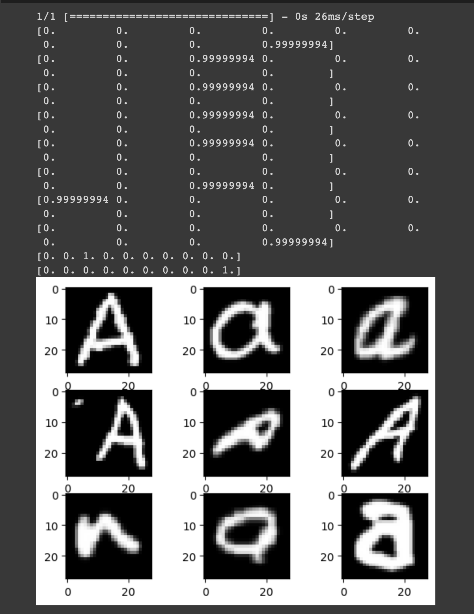

_(or, unexpected machine overconfidence)_

What happens when we learn something new? 

When you learn a new concept, I think we start by using existing language to describe it. I think it was in Julian Jaynes' "The Origin of Consciousness in the Breakdown of the Bicameral Mind" that claimed that everything you understand is mostly metaphors upon metaphors. ‘This new thing is like X – but like Y in this aspect’. 

So can we help machines learn a new concept on their own?

Theoretically, it’d possibly start by:
1. noticing something is weird (anomaly detection)
2. looking for a pattern in how its weird
3. make a new concept encompassing these weird patterns

To more concretely test this, what would happen if you trained a neural net on MNIST, and showed it a letter (‘A’, in this case)?  

Let me reformat its guesses for you:

9 | 2 | 2

2 | 2 | 8

0 | 9 | 2

In the first image, the numbers correspond to its confidence level for each conceptual option by position. They are all highly confident. At _least_ 99.999994% confident.

…why is it so confident? so _wrongly_ confidently??

I thought that I’d be able to at least tell it that ‘when there seems to be a trend in a certain mix between numbers, take note’. But it’s just so certain that it’s a number each time that I can’t utilize any sort of uncertainty to flag these letters as ‘odd’. It is currently unteachable – it believes that there is nothing for it to learn here. Nothing is weird, everything is fine, apparently.   

I think I need to probe deeper into how it arrived at these very confident-looking ‘decisions’. It’s probably a byproduct of the learning mechanism; I'm not sure how difficult of a fix it'd be yet.  

I think the next steps are to:
1. find the source of its seeming certainty, and divest it. 
2. Then we can actually start with anomaly detection, which was the first bottleneck I thought I'd encounter.

Also since there’s probably updates to image recognition now, I could look into what is currently state of the art and see if I encounter a similar problem. 

Addendum 2024/02/20:

I'm reading the book "The Evolution of Biological Information" and this sentence was reminiscent:
"The Brain is not confused by the out-of rhythm tones...Instead, these Brains fall into familiar patterns, and issue their (incorrect) verdicts with full confidence." (491)