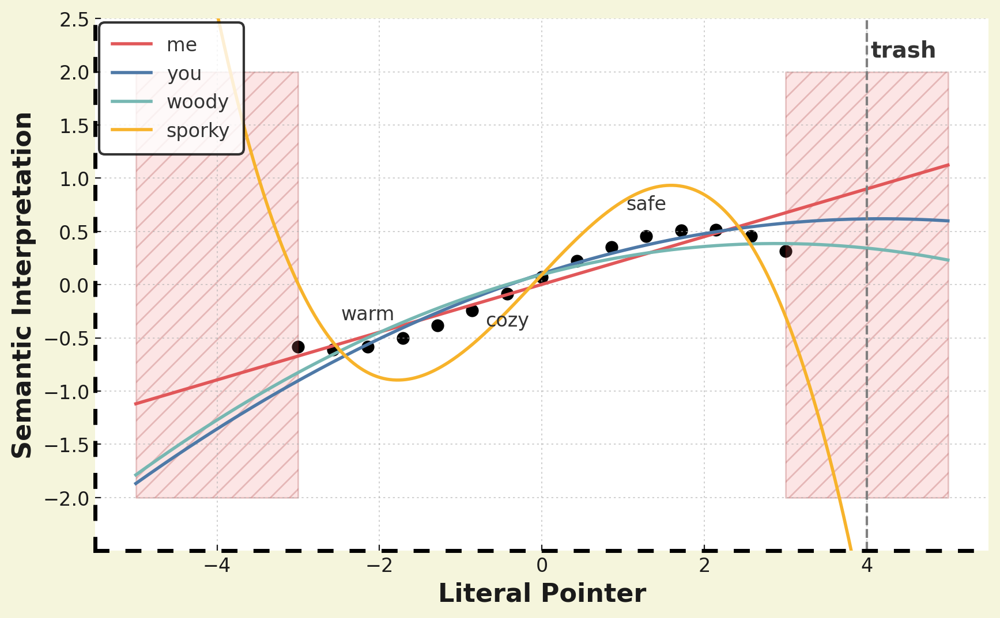

_warning: some spoilers for 'Frieren: At World's End'~~, which I haven't watched [April 2025]~~_

The last time I landed in JFK and stepped out of the terminal, I remember being hit by the nostalgic NYC smell, and I took a deep breath, feeling calmed, at home. 

For those of you who are unfamiliar with the scent I'm talking about, the first descriptor that comes to mind is, well -- it smells like garbage. 

I'm then reminded of Toy Story 5, [where Woody is trying to convince Sporky to stop running away from Bonnie](https://youtu.be/mjj0I2RbWzo?si=EO3aU-x1nWL-VHZQ&t=160), the kid who is attached to Sporky, and throwing himself into the trash. He finally makes headway when Sporky elaborates on what trash means to him:
- it's warm
- it's cozy
- and safe, 'like somebody's whispering in your ear, _everything's going to be okay_'
He informs Sporky that this is what Bonnie feels about him, leading Sporky to the wondrous revelation, 'I'm Bonnie's trash!'

I thought this was a surprisingly mature concept to illustrate, and suggested to me that this film was not exactly a children's film, but also a film geared to my generation who watched the original Toy Story as a kid, and who might need a refresher on how to emotionally connect with others successfully. Because while it doesn't seem particularly salient as a phenomena, it also seems to be everywhere at the same time, once you know to look for it.  

---

A good friend prides himself on liking Freiren before it was cool. He referenced an episode where a demon child pitifully crying 'mom' is taken in by humans. She eventually murders her caretaker. But it is already known that demons don't have a concept of family, and the unsettling twist is that she learned to say 'mom' because she learned that saying the word prevents humans from killing her. In this world, demons are bad because they use human language superficially, to get what they want. At first, I thought it was this mismapping that makes them evil. But he brought this up to illustrate the more benign phenomena where people think they understand each other because they're using words and phrases that do have meaningful pointers to the other person, but the internal mapping can be quite different.

And then another friend describes her baby learning to laugh: in the beginning, there was a phase where she said the baby was clearly fake laughing. Perhaps her baby, and babies' inclination to smile in general, is a type of demon-ing -- I don't know if they actually know what they're doing, if they understand what smiling does and means to their caretakers, but it sounds plausible that a default inclination for babies to reflexiviely smile and laugh would be evolutionarily selected for, they'd be more likely to be taken care of. Why do we not find this not creepy? Is it because they're helpless and benign?

Let's try a thought experiment:
Would it still be similarly bone-chilling if the demon in Frieren _functioned_ normally in society (i.e. no inclination towards murder or other anti-social tendencies) and still didn't internally experience 'mom' in the same way? I think not -- I suspect the unsettling aspect of this story is the combination of anti-social inclinations and the revelation of the degree of misalignment. 

The robot child in Spielberg's film A.I. likely also does not operate like us, but we find it sympathizable, unlike the demon child in Frieren. And despite also having a disconnect with human emotions, why is Frieran not a demon in this sense? 

Perhaps it's fundamentally an assessment of risk -- anti-social inclinations with unintentionally aligned frameworks make them seem plausibly reasoned with, and misalignment with eusocial inclinations/intentions is acceptable if functionally benign (arguably, the demon child was well-intentioned but dangerously missing some important norms, like an aversion to killing people as a solution path). 

Because it seems, 'all models are misaligned, but most are sufficiently benign'.

--- 

Like in the problem of language translation. In GEB, somewhere after first 50 pages that nearly everyone who reads GEB seems to have stopped at (while still claiming it to be a most excellent book), Hofstadter discusses the problem of language translation, of the problem trying to gesture to a certain semantic connotation given the pointers of the map that you have (something like, if you're trying to meet up with your friend in NYC when one of you have a street-only map and the other has a subway-only map, and maybe a mutual friend only works in latitudes and longitudes -- how to find each other?). But I suspect this concept does not merely apply to speakers of different languages, but also between people speaking the same language. 

For example, the UK is an easy place for an American to travel to because they also speak English, but I think it makes you complacent -- there's an increased risk of falsely believing you understand, when you actually don't understand. When I lived there, I had a flatmate who went to concerts every other weekend, and when others asked him how they went, he'd always say 'alright'. I thought him an odd character for continuing to go to these concerts when they seemed reliably disappointing. It wasn't until months later that I learned that 'alright' here meant '10/10', and not the 4/10 implication in American colloquialism.

But you don't necessarily avoid this even when you share the same culture: Perhaps one of the most common, recurring conflicts I have with my conversational friends of 10 years (we're from the same state and met in college) is having different semantics for the same word. Since it's pervasive even in what I considered a near optimal-compatibility case, this suggests to me that having these differences in semantic mappings may be inevitable, and it's happening all the time.

---

Then, how do we communicate effectively to each other at all?

I've developed the impression that we're not so dissimilar to a neural network, where we're trying to find some function to map input to output. And if its an area that is encountered often with clear feedback, like daily interactions, there is a lot of training data with functional feedback that is similar and so we each develop a sufficiently nuanced mapping to functionally coordinate. But remember that there are many functions that can approximate a distribution, and when you're out of distribution, or even at the edge of the distribution where your data points can be idiosyncratically skewed, there's a fair chance you won't find yourself in the same place as another.  

_ignore that our semantics of 'trash' are closer to 'warm', 'cozy', and 'safe' here._

(Anecdotally, the autistic people and immigrants around me seem to have a better time understanding this phenomena -- I think they've learned from experience that their semantic maps are often not aligned, and so have learned that a good troubleshooting heuristic is to ask a seemingly basic question, of 'what does this mean to you, in more words?'. It's sort of like calling your friend to try to locate them, and asking what landmarks they see around them. This is kind of expensive to do every time though, so generally I think people figure out better logistical heuristics. Or not notice/care that they're in a different location and can't see each other, which seems to be also a thing, but I haven't dissected that yet.)

